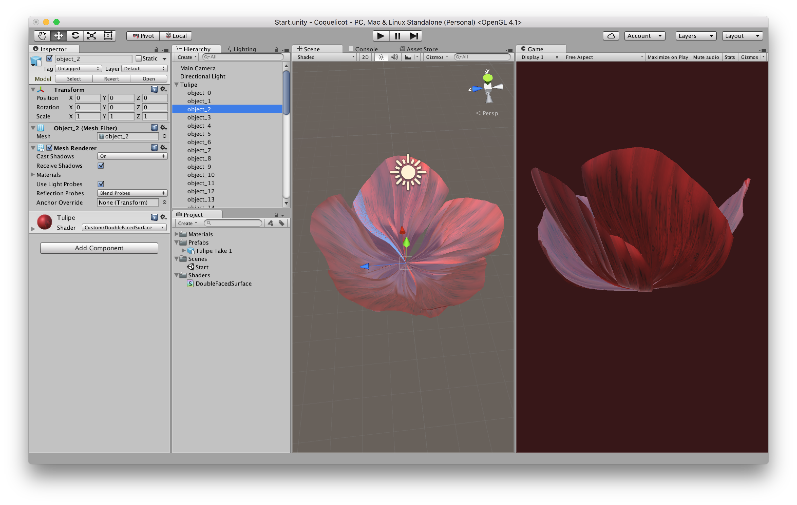

# Shapes · Coquelicot

## Overview

## Elements

## Sources

* Coquelicot: [uMake drawing (UMK)](Coquelicot.umk), [mesh (OBJ)](Coquelicot.obj)
* Coquelicot petal: [uMake drawing (UMK)](Coquelicot%20Petal%20Take%203.umk), [mesh (OBJ)](Coquelicot%20Petal%20Take%203.obj)
* Coquelicot stem: [uMake drawing (UMK)](Stem%20Take%203.umk), [mesh (OBJ)](Stem%20Take%203.obj)

## Documentation

* [_Making of_ ‹lotus flower› and ‹coquelicot› drawings](../../docs/making-of/README.md)
* [Sample usage of the ‹coquelicot› meshes in an Unity project](../../docs/usage/unity/coquelicot/)