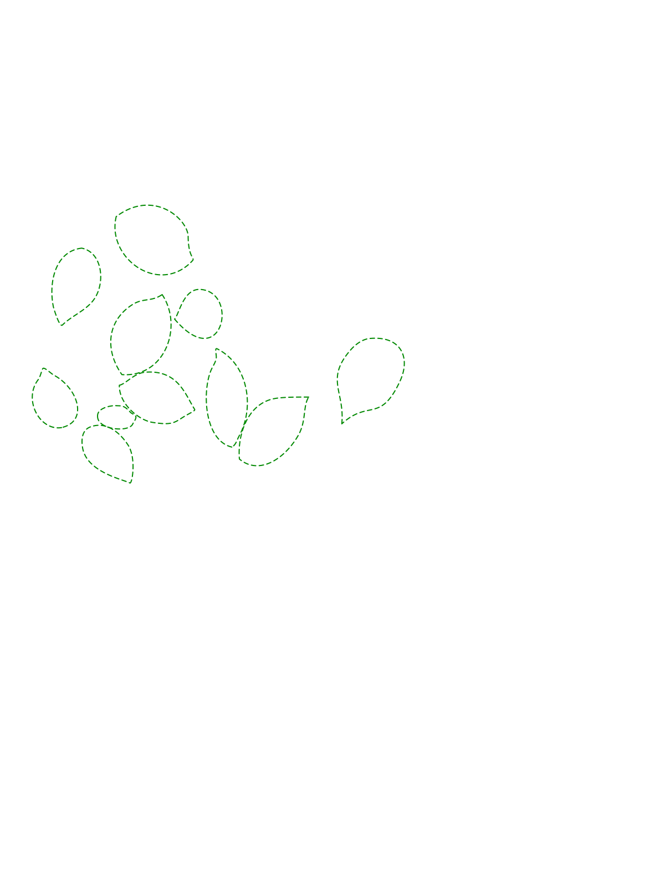
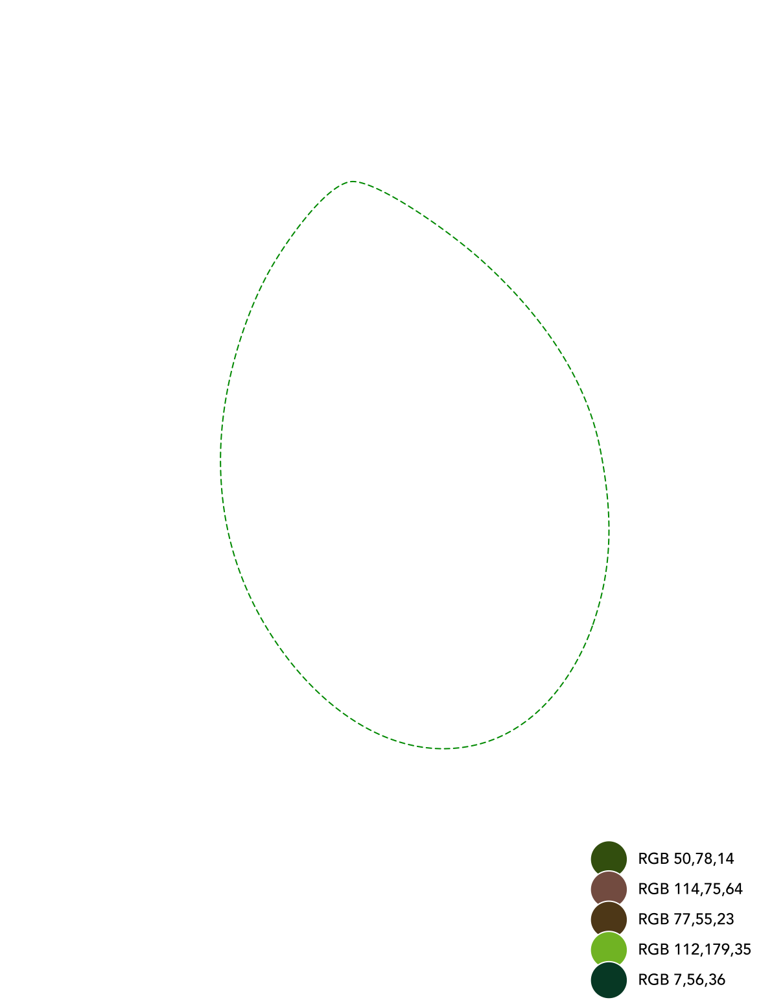
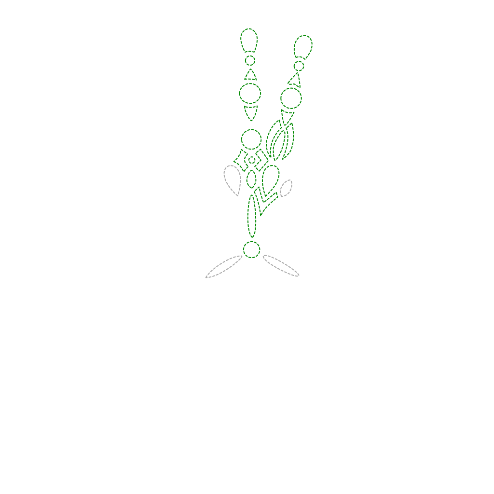
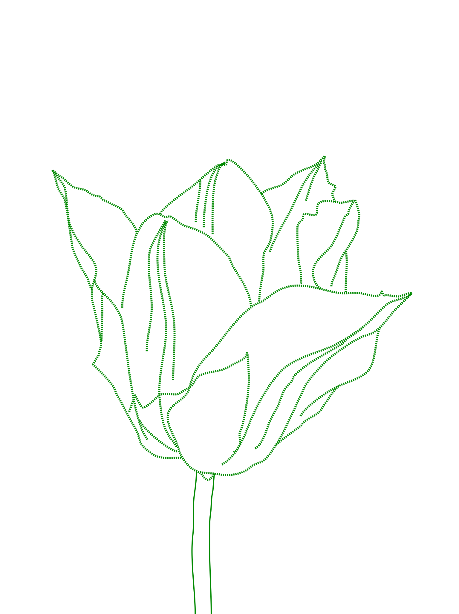
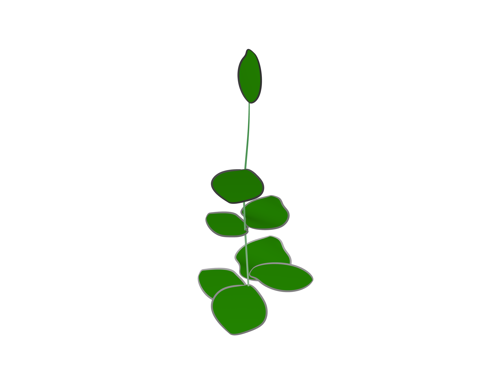
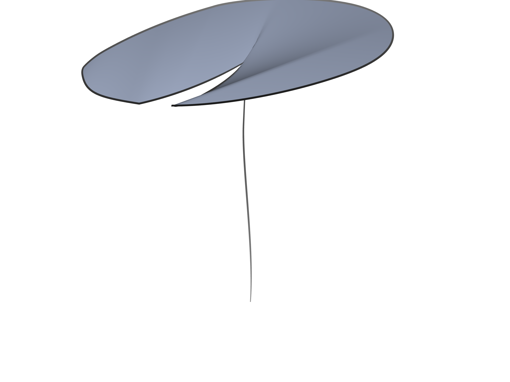
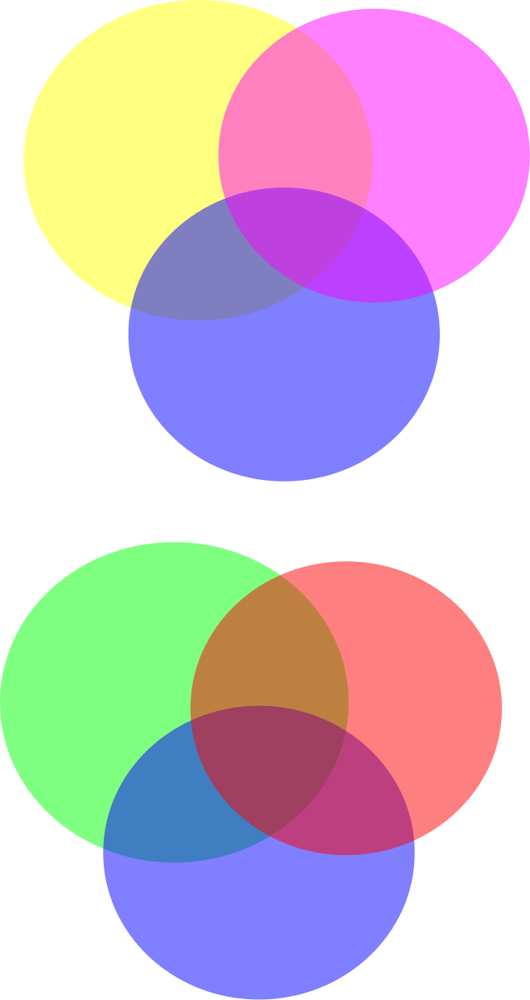
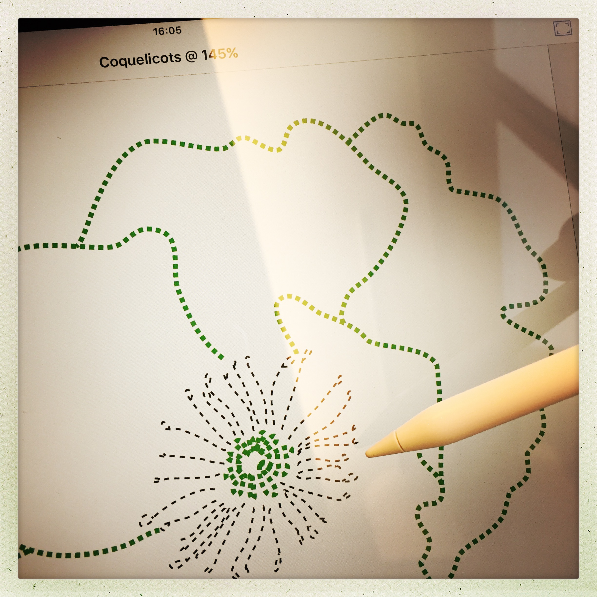

# Shapes

Hand-drawn vector shapes for Processing and Unity, and a few handpicked colors.

### 2D

### 3D

### Colors

## Contributing

The 2D shapes were drawn with [Envoza's InkPad](https://itunes.apple.com/app/inkpad-vector-design-illustration/id1057007769) on an _iPad Mini_, an app based on the open-source [InkPad app](https://github.com/sprang/Inkpad) created by [Steve Sprang](https://github.com/sprang/), using a _Wacom Creative Stylus_.

The 3D surfaces were drawn with the [uMake](https://itunes.apple.com/app/umake/id1042246861) app, on an _iPad Pro_ with an _Apple Pencil_ stylus.

## License

 
 Shapes de <a xmlns:cc="http://creativecommons.org/ns#" href="https://github.com/olange/shapes" property="cc:attributionName" rel="cc:attributionURL">Olivier Lange</a> est mis à disposition selon les termes de la <a rel="license" href="http://creativecommons.org/licenses/by-sa/4.0/">licence Creative Commons Attribution - Partage dans les Mêmes Conditions 4.0 International</a>.
 Fondé(e) sur une œuvre à <a xmlns:dct="http://purl.org/dc/terms/" href="https://github.com/olange/shapes" rel="dct:source">https://github.com/olange/shapes</a>.
